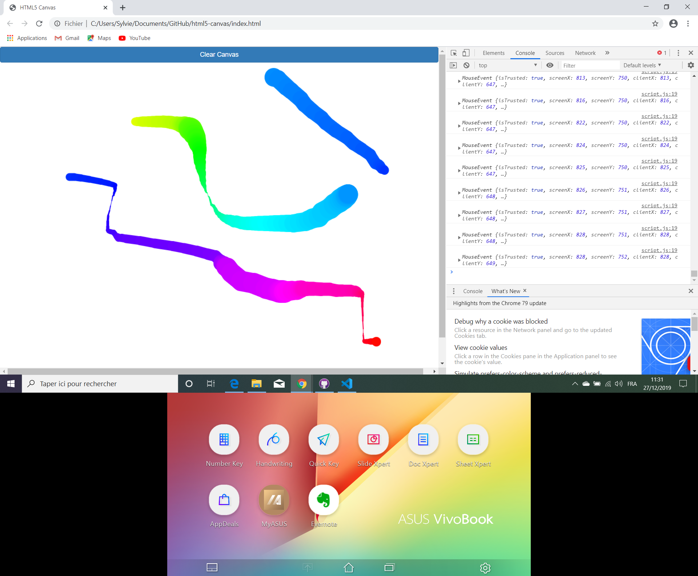

# Javascript30 Tutorial HTML5-Canvas

* Wes Bos Youtube Tutorial 8/30: [Let's build something fun with HTML5 Canvas - #JavaScript30 8/30](https://www.youtube.com/watch?v=8ZGAzJ0drl0).

*** Note: to open web links in a new window use: _ctrl+click on link_**

## Table of contents

* [General info](#general-info)
* [Screenshots](#screenshots)
* [Technologies](#technologies)
* [Setup](#setup)
* [Features](#features)
* [Status](#status)
* [Inspiration](#inspiration)
* [Contact](#contact)

## General info

* Draws coloured lines of varying width using mouse drawing events.

## Screenshots

.

## Technologies

* [Javascript v1.9 ECMA-262 ECMAScript 2018](http://www.ecma-international.org/publications/standards/Ecma-262.htm)

## Setup

* Open index.html in browser. If any code is changed the browser needs to be refreshed.

## Code Examples

* Code to clear content and listen to mouse drawing events.

```javascript
/*function to clear all content inside the defined canvas rectangle*/
clearCanvas = () => {
    ctx.clearRect(0,0, canvas.width, canvas.height);
}

canvas.addEventListener('mousedown', (e) => {  
  isDrawing = true;
  [lastX, lastY] = [e.offsetX, e.offsetY];
});

canvas.addEventListener('mousemove', draw);
canvas.addEventListener('mouseup', () => isDrawing = false);
canvas.addEventListener('mouseout', () => isDrawing = false);
```

## Features

* Function to clear canvas using HTML bootstrap button.

## Status & To-Do List

* Status: Working. Updated to work from browser, not from Glitch.

* To-Do: clear error; `index.html:16 Uncaught TypeError: Cannot set property 'innerHTML' of null
    at HTMLButtonElement.onclick (index.html:16)`

## Inspiration

* Wes Bos Youtube Tutorial 8/30: [Let's build something fun with HTML5 Canvas - #JavaScript30 8/30](https://www.youtube.com/watch?v=8ZGAzJ0drl0)

## Contact

Repo created by [ABateman](https://www.andrewbateman.org) - feel free to contact me!